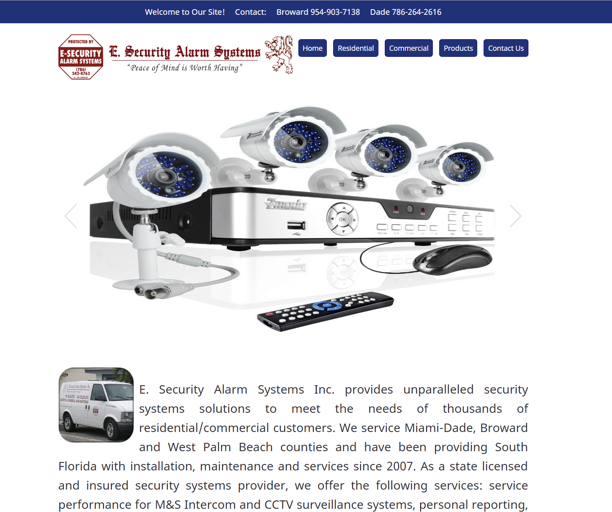

[E-Security](http://luminoushilt.github.io/E-Security/)
==========

##Project Website.

In this project and i am trying to convert this site from tables to a fully responsive website.  This will be my first responsive project; i'll be using flebox and incorporating gulp and it's autoprefixer to automate process like vendor prefixes.  I can use all of the help i can get it.  :-)